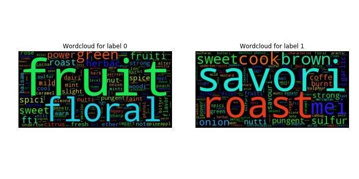
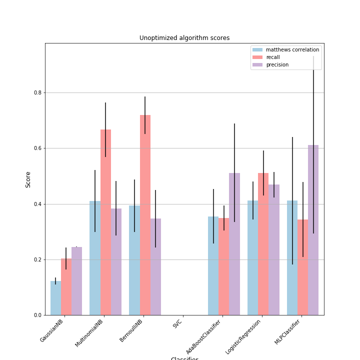
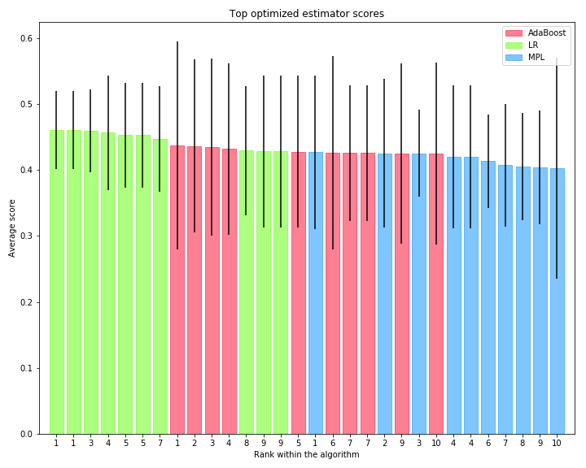
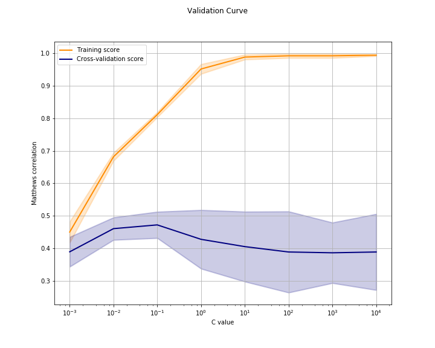
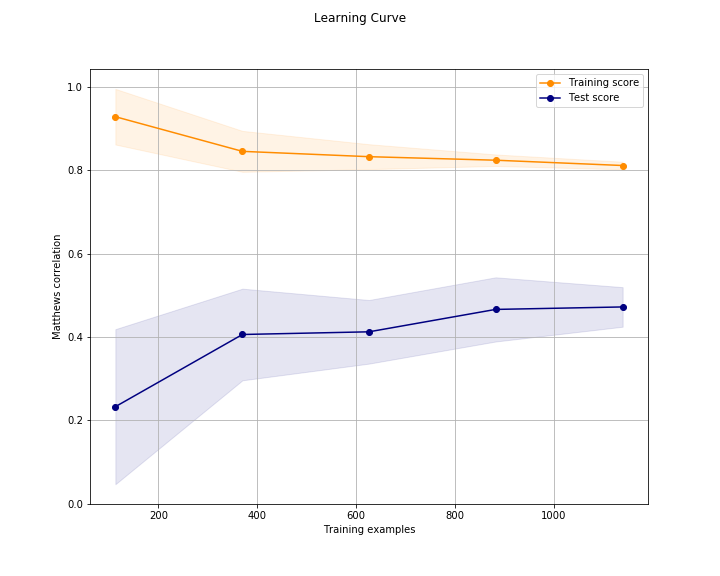

# Flavor chemical database and classifier

This project has 4 main parts: 

1) Scrape two flavor industry websites to create a database of flavor chemicals and their flavor descriptors 
2) Find the underlying flavor profiles in the database to create labels for a machine learning classifier
3) Calculate chemical properties that could be used as features in a machine learning classifier
4) Train a classifier to identify chemical class

## Making the flavor chemical database 

__[1_fema_extraction](1_fema_extraction.ipynb):__

In this notebook I extract information from the The Flavor and Extract Manufacturers Association (FEMA) website.

Each chemical has its own page (for example, [acetic acid](https://www.femaflavor.org/acetic-acid-2)) from which I extracted:
- Flavor descriptors
- FEMA and Chemical Abstracts Service (CAS) registry numbers

__[2_jecfa_extraction](2_jecfa_extraction.ipynb)__

In this notebook I extract information from the the Joint FAO/WHO Expert Committee on Food Additives  (JECFA) website.

Each chemical has its own page (for example, [acetic acid](http://www.fao.org/food/food-safety-quality/scientific-advice/jecfa/jecfa-flav/details/en/c/3/)) from which I extracted:
- Odor/flavor
- Synonyms
- Molecular weight
- JECFA and FEMA numbers

__[3_fema_jecfa_merge](3_fema_jecfa_merge.ipynb)__

In this notebook I merge the information extracted from the FEMA and JECFA websites. I make sure that each entry is for the same chemical and that all chemicals included have usable flavor/aroma descriptors.

__[4_rdkit_chemical_matching](4_rdkit_chemical_matching.ipynb)__

In this notebook I pair the chemicals found above with their RDkit representations. 

The [RDkit](http://www.rdkit.org/docs/Overview.html) is a chemical informatics toolkit. It allows for the calculation of chemical descriptors which can then be used as features for machine learning tasks. 

By this point I have __2170 chemicals__ that can be used to train a machine learning classifier. 

## Unsupervised clustering based on flavor descriptors

__[5_descriptor_clustering](5_descriptor_clustering.ipynb)__

In this notebook I use K-Means clustering to group the flavor chemicals based on their flavor and aroma descriptors.

I found two minimal groups: 

- One large __fruity, floral__ group with 1880 chemicals
- A smaller __savory, roast__ group with 290 chemicals

They can be visualized with word clouds of all the descriptors in each group:

I can now use these labels to train a supervised machine learning classifier.

## Calculating chemical properties to use as machine learning features

__[6_property_calculations](6_property_calculations.ipynb)__

In this notebook I use the RDKit to calculate several quantitative chemical properties. I also generated three different "chemical fingerprints" based on either chemical fragments or [topology](http://infochim.u-strasbg.fr/cgi-bin/predserv-cgi/ChemAxon/JChem/doc/user/ECFP.html) for each molecule. In all __4422 features__ were generated for each chemical.

## Training and testing a classifier to identify chemical class

__[7_algorithm_comparison](7_algorithm_comparison.ipynb)__

In this notebook I compare unoptimized Naive Bayes, Support Vector Machines, Adaboost, Logistic Regression, and Multi-layer Perceptron classifiers to see if any stand out with this dataset. 

A comparison of the the average and 95% confidence intervals in terms of precision, recall, Matthews correlation, and area under Receiver Operating Characteristic curve (roc_auc) for the unoptimized classifiers: 

Based on these results I decided to proceed with parameter optimization for:

- __Adaboost__
- __Logistic Regression__
- __Multi-layer perceptron__

Support Vector Machines performed badly, and Naive Bayes don't have many parameters to optimize, although its worth noting that the Bernoulli Naive Bayes performed as well (if not better in terms of recall) than the other top classifiers.

__[8_parameter_optimization](8_parameter_optimization.ipynb)__

In this notebook I exhaustively searched hyper-parameter space for the AdaBoost, Logistic Regression, and Multiple-layer Perceptron classifiers.

A comparison of the average scores and 95% confidence interval of the three optimized estimators:

These results indicate that the optimized __Logistic Regression classifier performed best__ with this dataset. 

__[9_estimator_analysis](9_estimator_analysis.ipynb)__

In this notebook I look at the best classifier and how it performs on the dataset. 

The best classifier was a [Logistic Regression](http://scikit-learn.org/stable/modules/linear_model.html#logistic-regression) algorithm with :
- Regularization __C parameter of 0.1__
- An roc_auc score of 0.76 on the held-out test data, which indicates that the estimator has a __0.76 probability of ranking a random savory chemical above a random non-savory chemical__.

The **_validation curve_** of this parameter shows that its C value is at the sweet spot with the highest score, and lowest amount of variability:

- Anything below 0.1 produces an underfit (high bias) model, with low training and test scores. 

- Anything above 0.1 produces an overfit (high variance) model, with high training scores that don't generalize to the test data.

The **_learning curve_** for this parameter argues that the current model is still relatively overfit (high variance) due to a persistent gap between training and test scores, regardless of training example size:

This suggests that the best way to further improve this estimator would be to __add more training examples__. 